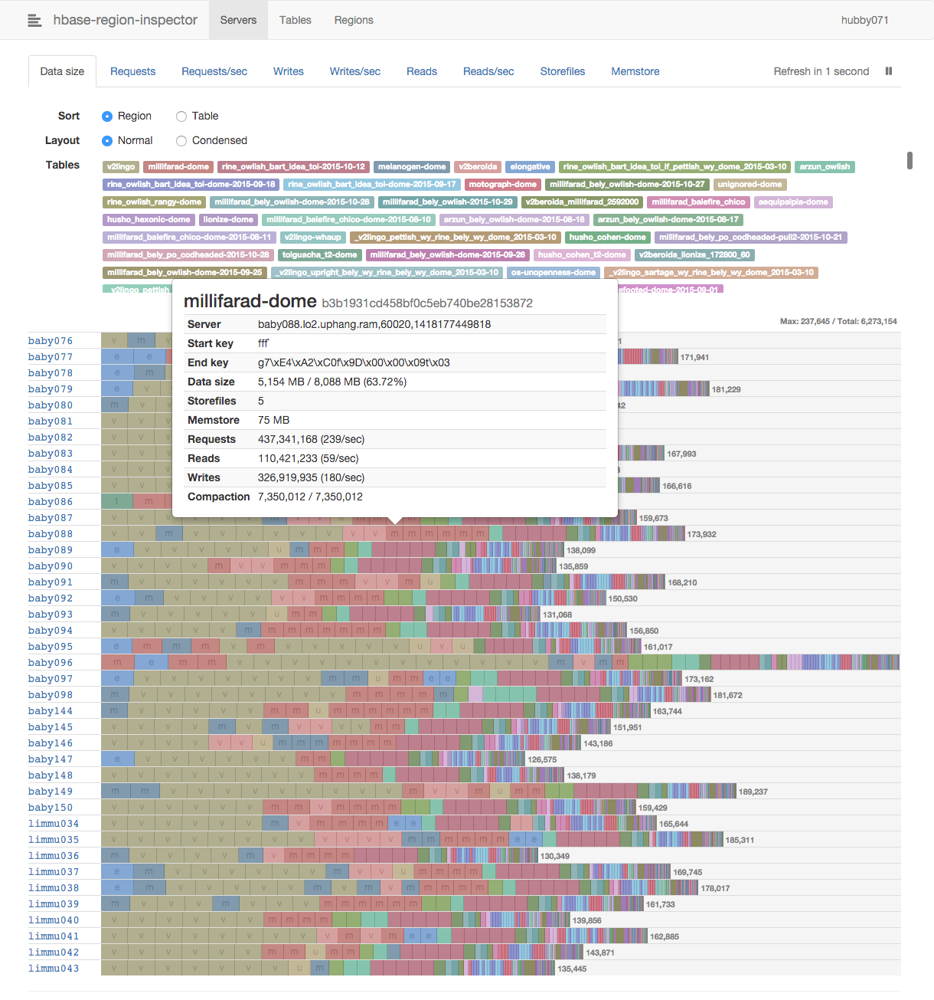

# hbase-region-inspector


### [View all Roadmaps](https://github.com/nholuongut/all-roadmaps) &nbsp;&middot;&nbsp; [Best Practices](https://github.com/nholuongut/all-roadmaps/blob/main/public/best-practices/) &nbsp;&middot;&nbsp; [Questions](https://www.linkedin.com/in/nholuong/)
<br/>

A visual dashboard of HBase region statistics.



## Usage

[Download the executable binary][rel] that matches the version of your HBase
cluster, add execute permission, and start it with the following command-line
arguments.

```
usage: hbase-region-inspector [OPTIONS] ┌ QUORUM[/ZKPORT] ┐ PORT [INTERVAL]
                                        └ CONFIG_FILE     ┘
  Options
    --admin       Enable drag-and-drop interface
    --no-system   Hide system tables
    --help        Show this message
```

[rel]: https://github.com/nholuongut/hbase-region-inspector/releases

### Accessing secured cluster

To access a secured HBase cluster, you have to prepare the following
configuration files:

- The main properties file
- JAAS login configuration
- Kerberos configuration (usually `/etc/krb5.conf`)
- Kerberos keytab (optional, but recommended)

You can find the examples in [conf-examples](conf-examples/).

### Environment variables

- `DEBUG` - Enable debug logs when set

## Development

### Prerequisites

- [NPM](https://www.npmjs.com/)
- [Leiningen](https://github.com/technomancy/leiningen)

```sh
# Using Homebrew on Mac OS X
brew install npm leiningen
```

### Setting up REPL on tmux panes

```sh
# For HBase 0.98 and above
./hacking

# HBase 0.94 (CDH4)
./hacking cdh4
```

### Build

```sh
# For HBase 0.98 and above
make

# HBase 0.94 (CDH4)
make profile=cdh4
```

# 🚀 I'm are always open to your feedback.  Please contact as bellow information:
### [Contact ]
* [Name: Nho Luong]
* [Skype](luongutnho_skype)
* [Github](https://github.com/nholuongut/)
* [Linkedin](https://www.linkedin.com/in/nholuong/)
* [Email Address](luongutnho@hotmail.com)
* [PayPal.me](https://www.paypal.com/paypalme/nholuongut)


[](https://ko-fi.com/nholuong)

# License
* Nho Luong (c). All Rights Reserved.🌟
